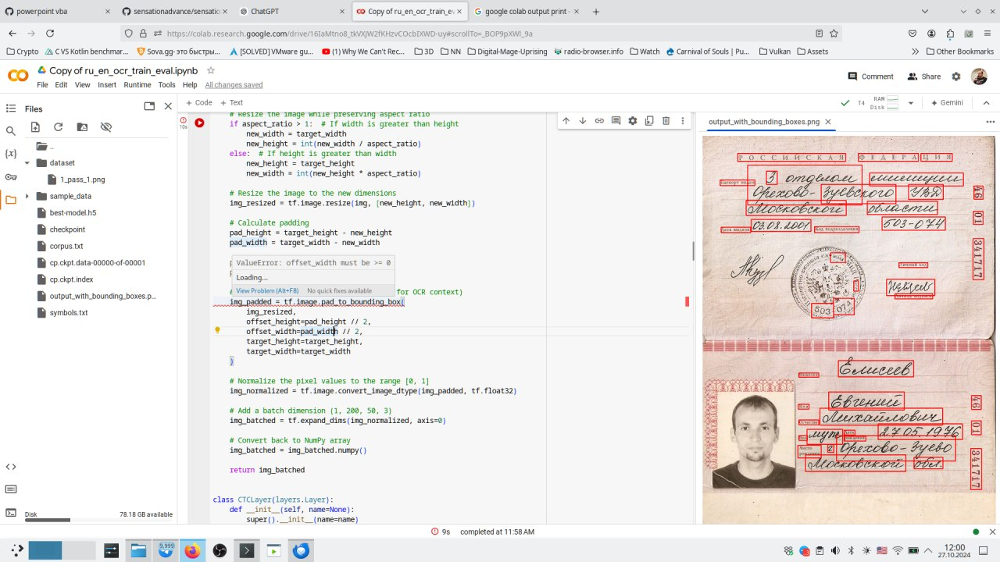

# OCR_APP
OCR_APP

Этот проект предназначен для выполнения оптического распознавания текста (OCR) с функцией сегментации текстовых фрагментов. Сегментация осуществляется в блокноте Jupyter `segmentation.ipynb`. Данный проект может быть полезен для разделения текста на логические блоки в сложных изображениях, таких как документы, формы и таблицы.

## Возможности

- Сегментация текста на отдельные блоки
- Настраиваемый блокнот `segmentation.ipynb` для запуска и экспериментов

## Начало работы

### Требования

- Python 3.x
- [Jupyter Notebook](https://jupyter.org/install)
